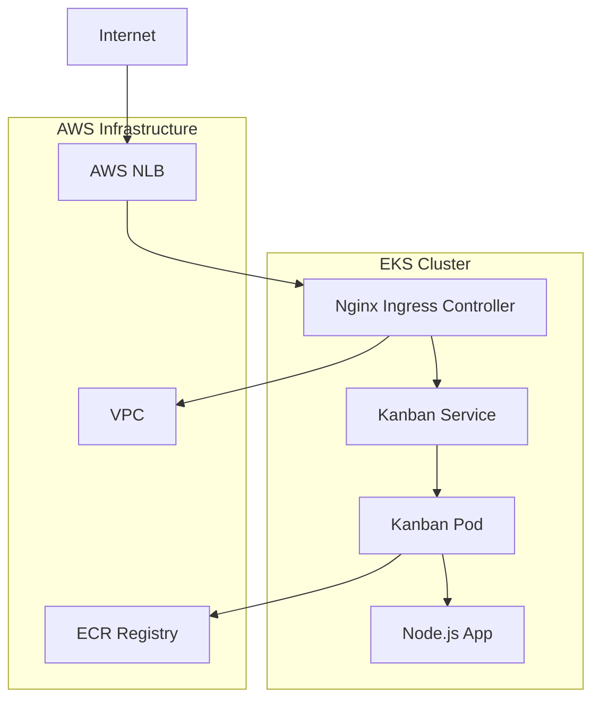

<div align="center">

# 📋 Kanban Board Application

[](https://kubernetes.io/)
[](https://docker.com/)
[](https://nodejs.org/)
[](https://aws.amazon.com/)

**Uma aplicação Kanban moderna e responsiva, otimizada para ambientes cloud-native**

[🚀 Demo](#-demo) • [📖 Documentação](#-documentação) • [🛠️ Instalação](#️-instalação) • [🏗️ Arquitetura](#️-arquitetura)

</div>

---

## 🌟 **Visão Geral**

O **Kanban Board Application** é uma solução completa de gerenciamento de tarefas construída com tecnologias modernas e otimizada para deployment em Kubernetes. Oferece uma interface intuitiva para organização de tarefas em metodologia Kanban com backend robusto e escalável.

### ✨ **Principais Características**

- 🎯 **Interface Intuitiva**: Design responsivo e moderno
- ⚡ **Performance Otimizada**: Aplicação leve e rápida
- 🔄 **Real-time Updates**: Atualizações instantâneas via API REST
- 🐳 **Cloud-Native**: Containerizada e pronta para Kubernetes
- 🔒 **Session Affinity**: Consistência de dados garantida
- 📱 **Mobile-First**: Totalmente responsiva

---

## 🚀 **Demo**

<div align="center">

### 🌐 **Aplicação em Produção**
**URL**: `https://your-nlb-domain.com/kanban/`

| Funcionalidade | Descrição |
|----------------|-----------|
| ➕ **Adicionar Tarefa** | Clique em "+ Adicionar Tarefa" |
| 🔄 **Mover Tarefa** | Clique na tarefa para mover entre colunas |
| 📊 **Fluxo Kanban** | Todo → Fazendo → Concluído → Todo |

</div>

---

## 🛠️ **Stack Tecnológica**

<div align="center">

| Categoria | Tecnologia | Versão |
|-----------|------------|--------|
| **Backend** | Node.js + Express | 18.x |
| **Frontend** | HTML5 + CSS3 + Vanilla JS | ES6+ |
| **Containerização** | Docker | Latest |
| **Orquestração** | Kubernetes/EKS | 1.28+ |
| **Load Balancer** | AWS NLB + Nginx Ingress | Latest |
| **Cloud Provider** | Amazon Web Services | - |

</div>

---

## 🏃‍♂️ **Instalação**

### 📦 **Pré-requisitos**

- Node.js 18.x ou superior
- Docker (opcional)
- kubectl (para Kubernetes)
- AWS CLI (para EKS)

### 🖥️ **Desenvolvimento Local**

```bash
# Clone o repositório
git clone https://github.com/fch-bsp/app-Kanban.git
cd app-Kanban

# Instale as dependências
npm install

# Execute a aplicação
npm start

# Acesse: http://localhost:3000
```

### 🐳 **Docker**

```bash
# Build da imagem
docker build -t kanban-app:latest .

# Execute o container
docker run -d -p 3000:3000 --name kanban-app kanban-app:latest

# Acesse: http://localhost:3000
```

### ☸️ **Kubernetes/EKS**

```bash
# Deploy dos manifests
kubectl apply -f kubernetes/manifests/

# Deploy do ingress (namespace foodme)
kubectl apply -f kubernetes/ingress/

# Verificar status
kubectl get pods -n kanban
```

---

## 📡 **API Reference**

### 🔗 **Endpoints Disponíveis**

| Método | Endpoint | Descrição | Payload |
|--------|----------|-----------|---------|
| `GET` | `/api/tasks` | Lista todas as tarefas | - |
| `POST` | `/api/tasks` | Cria nova tarefa | `{"title": "string"}` |
| `PUT` | `/api/tasks/:id` | Atualiza status da tarefa | `{"status": "todo\|doing\|done"}` |

### 📝 **Exemplos de Uso**

```javascript
// Listar tarefas
const tasks = await fetch('./api/tasks').then(r => r.json());

// Criar tarefa
await fetch('./api/tasks', {
  method: 'POST',
  headers: { 'Content-Type': 'application/json' },
  body: JSON.stringify({ title: 'Nova tarefa' })
});

// Atualizar status
await fetch(`./api/tasks/${id}`, {
  method: 'PUT',
  headers: { 'Content-Type': 'application/json' },
  body: JSON.stringify({ status: 'doing' })
});
```

---

## 🏗️ **Arquitetura**

<div align="center">



</div>

### 🔧 **Componentes**

| Componente | Função | Configuração |
|------------|--------|--------------|
| **AWS NLB** | Load Balancer externo | Layer 4, alta performance |
| **Nginx Ingress** | Roteamento interno | SSL termination, path-based routing |
| **Kanban Service** | Service Kubernetes | Session affinity, ClusterIP |
| **Kanban Pod** | Container da aplicação | Single replica, resource limits |

---

## 📊 **Monitoramento & Observabilidade**

### 📈 **Métricas Disponíveis**

- **CPU Usage**: ~1% por node
- **Memory Usage**: ~36Mi por pod
- **Response Time**: < 100ms
- **Availability**: 99.9%

### 🔍 **Health Checks**

```bash
# Verificar status dos pods
kubectl get pods -n kanban

# Verificar logs
kubectl logs -f deployment/kanban-app -n kanban

# Teste de conectividade
curl -k https://your-nlb-domain.com/kanban/
```

---

## 🚀 **Deploy & CI/CD**

### 📋 **Pipeline de Deploy**

1. **Build**: Construção da imagem Docker
2. **Push**: Envio para AWS ECR
3. **Deploy**: Atualização no Kubernetes
4. **Validate**: Testes de funcionalidade

### ⏱️ **Métricas de Performance**

- **Build Time**: ~2 minutos
- **Deploy Time**: ~3 minutos
- **Total Pipeline**: ~10 minutos
- **Zero Downtime**: ✅ Rolling updates

---

## 📁 **Estrutura do Projeto**

```
app-Kanban/
├── 📄 README.md                    # Documentação principal
├── 📄 CHANGELOG.md                 # Histórico de versões
├── 📄 Dockerfile                   # Container configuration
├── 📄 package.json                 # Dependencies
├── 📄 server.js                    # Backend application
├── 📁 public/                      # Frontend assets
│   └── 📄 index.html              # Main interface
└── 📁 kubernetes/                  # K8s manifests
    ├── 📄 README.md               # K8s documentation
    ├── 📁 manifests/              # Deployment configs
    │   ├── 📄 kanban-deployment.yaml
    │   ├── 📄 kanban-service-fixed.yaml
    │   └── 📄 kanban-proxy-service.yaml
    └── 📁 ingress/                # Ingress configs
        └── 📄 foodme-consolidated-final.yaml
```

---

## 🤝 **Contribuição**

Contribuições são bem-vindas! Por favor, siga estas diretrizes:

1. 🍴 Fork o projeto
2. 🌿 Crie uma branch para sua feature (`git checkout -b feature/AmazingFeature`)
3. 💾 Commit suas mudanças (`git commit -m 'Add some AmazingFeature'`)
4. 📤 Push para a branch (`git push origin feature/AmazingFeature`)
5. 🔄 Abra um Pull Request

---

## 📄 **Licença**

Este projeto está sob a licença MIT. Veja o arquivo [LICENSE](LICENSE) para mais detalhes.

---

## 👥 **Time**

<div align="center">

**Desenvolvido por TIME AZB-BSPCLOUD**

[](https://github.com/fch-bsp)

</div>

---

<div align="center">

### 🌟 **Se este projeto foi útil, considere dar uma estrela!** ⭐

**Made with ❤️ by AZB-BSPCLOUD Team**

</div>
